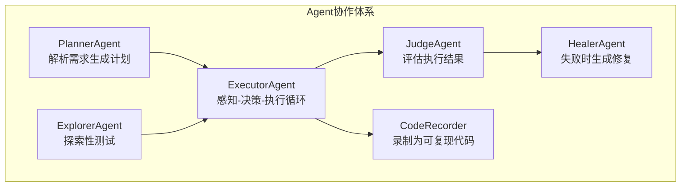
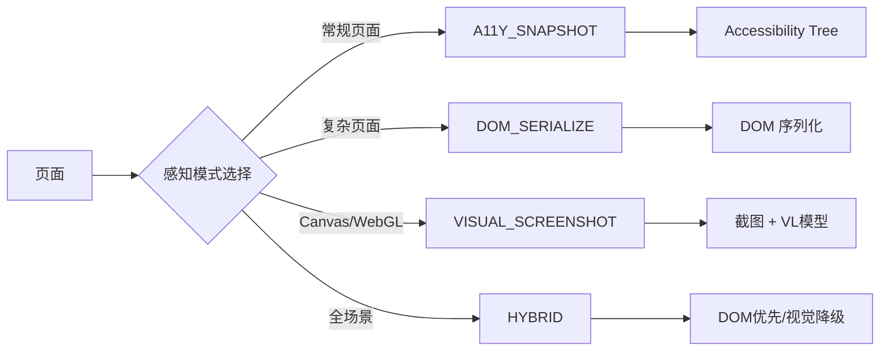
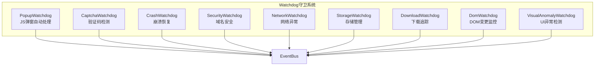
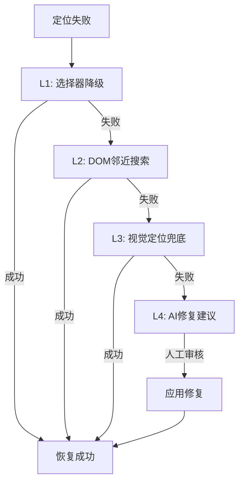
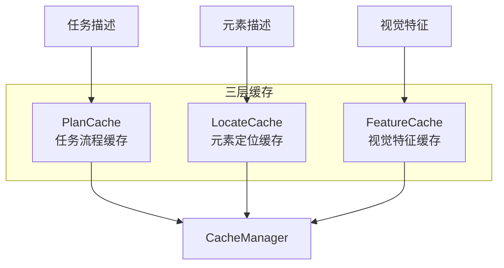
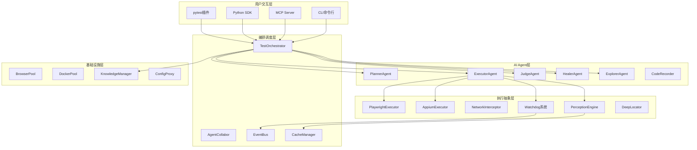
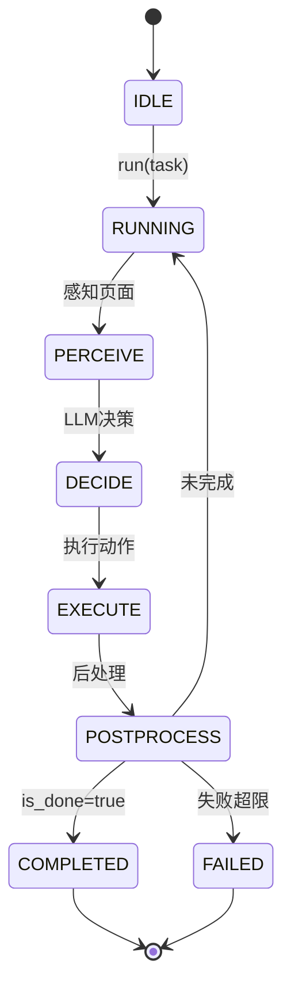
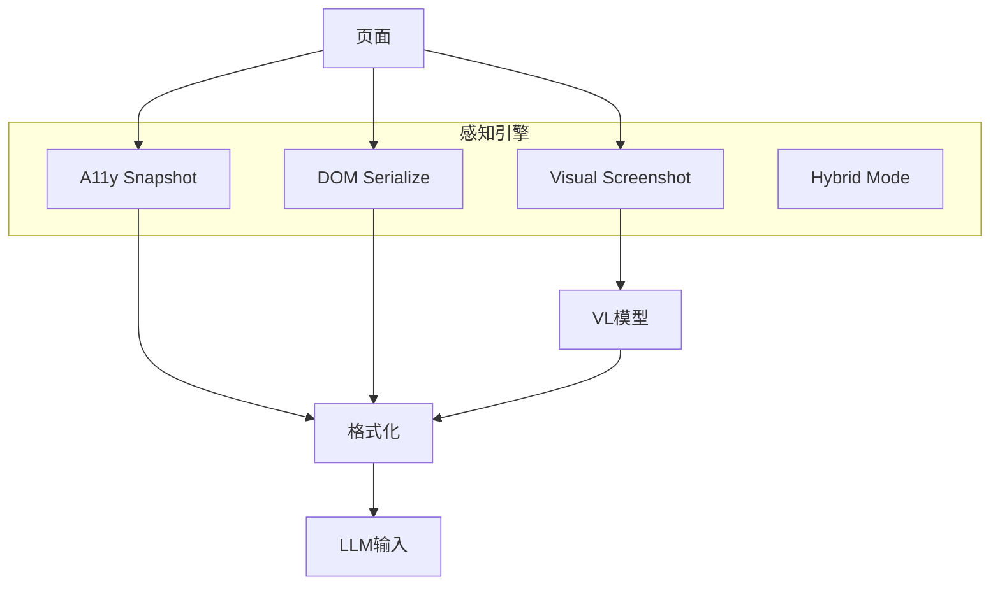
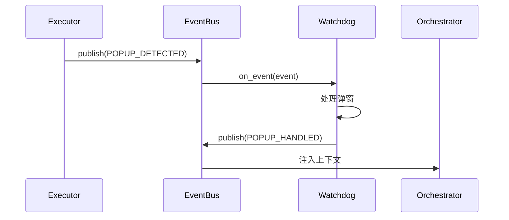

# UIAI 官方开源文档

> **UIAI** — AI 驱动的 UI 自动化测试框架，让测试人员用自然语言描述测试需求，由 AI Agent 自动执行测试、断言验证、失败自愈、生成报告。

---

## 目录

1. [项目介绍](#一项目介绍)
2. [快速开始](#二快速开始)
3. [核心概念](#三核心概念)
4. [配置详解](#四配置详解)
5. [API 参考](#五api-参考)
6. [CLI 命令参考](#六cli-命令参考)
7. [最佳实践](#七最佳实践)
8. [故障排查](#八故障排查)
9. [架构设计](#九架构设计)
10. [开发者指南](#十开发者指南)
11. [版本历史](#十一版本历史)

---

## 一、项目介绍

### 1.1 什么是 UIAI？

UIAI 是一个**自研代码 Agent 中控 + 开源技术底座**的混合分层自动化测试框架。它将 AI 大模型的能力与传统自动化测试技术深度融合，实现了：

- **自然语言驱动测试**：用中文描述测试需求，AI 自动理解并执行
- **AI Agent 自主执行**：六种 Agent 协作完成测试全流程
- **失败自动自愈**：四层降级策略自动修复定位失败
- **知识沉淀积累**：自动积累测试经验，越用越智能

### 1.2 核心特性

| 特性 | 说明 |
|------|------|
| **六 Agent 协作** | PlannerAgent / ExecutorAgent / JudgeAgent / HealerAgent / ExplorerAgent / CodeRecorder |
| **四层运行模式** | R1_SCRIPT（确定性脚本） / R2_AGENT（智能 Agent） / R3_LOCAL_DEV（本地开发） |
| **四种感知模式** | A11Y_SNAPSHOT / DOM_SERIALIZE / VISUAL_SCREENSHOT / HYBRID |
| **九种 Watchdog** | 弹窗、验证码、崩溃、安全、网络、存储、下载、DOM 变更、UI 异常 |
| **三层缓存系统** | PlanCache / LocateCache / FeatureCache |
| **四层自愈降级** | 选择器降级 → DOM 邻近搜索 → 视觉定位兜底 → AI 修复建议 |
| **三级知识沉淀** | 需求级 / 产品级 / 经验级 |
| **多模型意图路由** | LOCATE → VL 模型 / PLAN → 强 LLM / EXTRACT → 轻量模型 |

### 1.3 支持平台

| 平台 | 执行引擎 | 说明 |
|------|---------|------|
| **Web** | Playwright | Chromium / Firefox / Safari |
| **H5** | Playwright | 移动端 Web 应用 |
| **Android** | Appium | UiAutomator2 |
| **iOS** | Appium | XCUITest |
| **小程序** | Playwright | 微信/支付宝小程序 |
| **桌面应用** | Playwright | Electron 应用 |

### 1.4 与其他方案对比

| 特性 | UIAI | Selenium | Cypress | Playwright |
|------|------|----------|---------|------------|
| 自然语言驱动 | ✅ | ❌ | ❌ | ❌ |
| AI 自主执行 | ✅ | ❌ | ❌ | ❌ |
| 失败自动自愈 | ✅ 四层降级 | ❌ | ❌ | ❌ |
| 视觉定位 | ✅ VL 模型 | ❌ | ❌ | ❌ |
| 知识沉淀 | ✅ 三级知识 | ❌ | ❌ | ❌ |
| Watchdog 守卫 | ✅ 9 种 | ❌ | ❌ | ❌ |
| 代码录制 | ✅ 自动生成 | ❌ 手写 | ❌ | ❌ |

### 1.5 适用场景

**推荐使用 UIAI：**

- 测试团队希望减少手写代码工作量
- 测试用例频繁变更，维护成本高
- 需要探索性测试发现潜在问题
- 希望自动积累测试经验知识
- 多平台测试（Web/App/H5）

**可能不适合：**

- 简单的静态页面测试（传统脚本更高效）
- 无 LLM API 访问权限
- 极高实时性要求（Agent 循环有延迟）

---

## 二、快速开始

### 2.1 环境要求

- Python 3.10+
- Node.js 18+（用于 Playwright）
- LLM API 访问权限（OpenAI / 阿里云 DashScope / 火山引擎 / Ollama）

### 2.2 安装

```bash
# 安装 UIAI
pip install uiai

# 安装 Playwright 浏览器
playwright install chromium

# 可选：安装 Appium（用于移动端测试）
pip install Appium-Python-Client
```

### 2.3 最简示例

#### R2 Agent 模式（自然语言驱动）

```python
import asyncio
from uiai import TestOrchestrator
from uiai.config import UIAIConfig

async def main():
    # 创建配置
    config = UIAIConfig()
    config.llm.api_key = "your-api-key"
    config.llm.model = "gpt-4o"
    
    # 创建编排器
    orchestrator = TestOrchestrator(config)
    
    # R2 Agent 模式：自然语言执行
    result = await orchestrator.run_agent_test(
        "打开百度搜索，输入'UIAI自动化测试'，点击搜索按钮，验证结果页包含相关内容"
    )
    
    print(f"测试结果: {result.status.value}")
    print(f"执行步数: {len(result.steps)}")
    print(f"耗时: {result.duration_ms}ms")

asyncio.run(main())
```

#### R1 脚本模式（确定性脚本）

```python
import asyncio
from uiai import TestOrchestrator, TestCase, Locator
from uiai.config import UIAIConfig
from uiai.core.test_case import Priority

async def main():
    config = UIAIConfig()
    orchestrator = TestOrchestrator(config)
    
    # 定义测试用例
    test = TestCase(
        id="login_test",
        name="用户登录测试",
        priority=Priority.HIGH,
    )
    
    # 添加测试步骤（链式调用）
    test.add_step("导航到登录页", "navigate", value="https://example.com/login")
    test.add_step("输入用户名", "type", locator=Locator.by_test_id("username"), value="admin")
    test.add_step("输入密码", "type", locator=Locator.by_test_id("password"), value="123456")
    test.add_step("点击登录按钮", "click", locator=Locator.by_role("button", name="登录"))
    test.add_step("验证跳转到首页", "assert_url", value="https://example.com/home")
    
    # 执行测试
    result = await orchestrator.run_test(test)
    print(f"结果: {result.status.value}")

asyncio.run(main())
```

### 2.4 CLI 快速使用

```bash
# 初始化项目
uiai init my-test-project

# 运行测试
uiai run https://example.com --mode agent

# 生成测试计划
uiai plan "测试购物车功能" --url https://example.com

# AI 探索性测试
uiai explore https://example.com

# 查看框架信息
uiai info
```

### 2.5 配置文件示例

创建 `uiai.yaml` 配置文件：

```yaml
browser:
  browser_type: chromium
  headless: true
  viewport:
    width: 1280
    height: 720
  record_trace: true

llm:
  provider: openai
  model: gpt-4o
  api_key: ""  # 或设置环境变量 OPENAI_API_KEY
  base_url: ""  # 可选：自定义 endpoint
  vl_model: ""  # 视觉语言模型
  fallback_model: gpt-3.5-turbo  # 备用模型

healing:
  enabled: true
  auto_apply: false  # 修复需人工审核
  max_retries: 3
  strategies:
    - selector_fallback
    - dom_neighbor_search
    - visual_ocr
    - ai_code_fix

report:
  output_dir: ./reports
  format: html
  include_screenshots: true

base_url: https://example.com
timeout: 30000
env: test
```

---

## 三、核心概念

### 3.1 六 Agent 协作体系

UIAI 的核心是六种 Agent 的协作，每种 Agent 负责不同的职责：



| Agent | 职责 | 输入 | 输出 |
|-------|------|------|------|
| **PlannerAgent** | 解析自然语言需求，生成测试计划 | 需求描述 + 知识上下文 | 测试计划（Markdown） |
| **ExecutorAgent** | 感知页面状态，决策下一步动作，执行操作 | 任务描述 + 页面感知 | 执行历史 + 提取数据 |
| **JudgeAgent** | 独立评估执行结果是否成功 | 任务描述 + 执行历史 | 评估结论 + 失败原因 |
| **HealerAgent** | 分析失败原因，生成修复建议 | 失败步骤 + 错误信息 | 修复建议（需审核） |
| **ExplorerAgent** | AI 探索性测试，发现潜在问题 | 应用 URL + 探索范围 | 发现的问题列表 |
| **CodeRecorder** | 录制执行过程为可复现代码 | 执行历史 | Python 测试代码 |

### 3.2 四层运行模式

| 层级 | 模式 | 说明 | 适用场景 |
|------|------|------|---------|
| **R1_SCRIPT** | 确定性脚本 | 手写/录制的 Python 测试代码 | 稳定功能回归测试 |
| **R2_AGENT** | 智能 Agent 辅助 | Agent 感知 + LLM 决策 + 执行循环 | 新功能测试、复杂场景 |
| **R3_LOCAL_DEV** | 本地开发 | MCP Server + Claude Code CLI | 本地开发调试 |

#### R1_SCRIPT 模式

```python
# 确定性脚本，每个步骤明确指定
test = TestCase(id="login", name="登录测试")
test.add_step("导航", "navigate", value="https://example.com/login")
test.add_step("输入用户名", "type", locator=Locator.by_test_id("username"), value="admin")
test.add_step("点击登录", "click", locator=Locator.by_role("button", name="登录"))
```

#### R2_AGENT 模式

```python
# 自然语言驱动，Agent 自主决策
result = await orchestrator.run_agent_test(
    "登录系统后查看订单列表，验证订单状态正确显示"
)
```

### 3.3 四种感知模式

Agent 如何"看"页面：



| 模式 | 说明 | Token 消耗 | 适用场景 |
|------|------|-----------|---------|
| **A11Y_SNAPSHOT** | Accessibility Tree 快照 | 低（~500 tokens） | 常规页面，信息结构清晰 |
| **DOM_SERIALIZE** | DOM 序列化，带元素索引 | 中（~2000 tokens） | 复杂页面，需要完整信息 |
| **VISUAL_SCREENSHOT** | 纯视觉截图 + VL 模型 | 高（~1500 tokens + 图片） | Canvas/WebGL 页面 |
| **HYBRID** | DOM 优先，视觉降级 | 动态 | 全场景覆盖，自动降级 |

### 3.4 九种 Watchdog 守卫

测试执行过程中自动监控和应对：



| Watchdog | 职责 | 自动处理 |
|----------|------|---------|
| **PopupWatchdog** | 监听 JS 弹窗 | 自动关闭 alert/confirm/prompt |
| **CaptchaWatchdog** | 检测验证码元素 | TOTP/HOTP 自动处理，否则通知人工 |
| **CrashWatchdog** | 检测浏览器崩溃 | 自动重启浏览器，恢复到最近检查点 |
| **SecurityWatchdog** | 域名安全守卫 | 拦截非白名单域名导航 |
| **NetworkWatchdog** | 网络异常检测 | 触发重试或降级策略 |
| **StorageWatchdog** | Cookie/LocalStorage 管理 | 自动保存恢复存储状态 |
| **DownloadWatchdog** | 文件下载追踪 | 等待下载完成，记录路径 |
| **DomWatchdog** | DOM 变更监控 | 触发缓存失效 |
| **VisualAnomalyWatchdog** | UI 异常检测 | 白屏、空图、元素堆叠检测 |

### 3.5 四层自愈降级

定位失败时自动尝试修复：



| 层级 | 策略 | 说明 | 自动化程度 |
|------|------|------|-----------|
| **L1** | 选择器降级 | 尝试 Locator 的 fallback chain | 自动 |
| **L2** | DOM 邻近搜索 | 在 A11y Tree 中搜索相似元素 | 自动 |
| **L3** | 视觉定位兜底 | VL 模型视觉定位元素 | 自动 |
| **L4** | AI 修复建议 | LLM 分析失败原因，生成修复建议 | 需人工审核 |

### 3.6 三层缓存系统

减少 LLM 调用，提升执行效率：



| 缓存层 | 键 | 值 | 失效条件 |
|--------|-----|-----|---------|
| **PlanCache** | 任务描述哈希 | 工作流步骤列表 | 页面结构哈希变化 |
| **LocateCache** | 元素描述 | 定位信息（selector/rect） | 元素位置/形态变化 |
| **FeatureCache** | 元素描述 | 视觉特征向量 | 视觉样式变化 |

### 3.7 三级知识沉淀系统

自动积累测试经验：

| 级别 | 来源 | 说明 | 示例 |
|------|------|------|------|
| **需求级** | 需求文档、用户故事 | 业务需求知识 | "购物车最多添加 99 件商品" |
| **产品级** | 产品文档、设计规范 | 产品功能说明 | "登录页面布局规范" |
| **经验级** | 测试执行中的积累 | 成功/失败案例 | "登录成功后跳转到首页" |

### 3.8 多模型意图路由

不同任务自动路由到最优模型：

| 意图 | 模型类型 | 说明 | 示例模型 |
|------|---------|------|---------|
| **LOCATE** | VL 模型 | 元素定位 | UI-TARS-7B |
| **PLAN** | 强 LLM | 任务规划 | GPT-4o / Qwen-Plus |
| **EXTRACT** | 轻量模型 | 信息提取 | GPT-3.5 / Qwen-Turbo |
| **ASSERT** | VL 模型 | 视觉断言 | GPT-4-Vision |
| **HEAL** | LLM | 自愈修复 | GPT-4o |

---

## 四、配置详解

### 4.1 配置文件结构

UIAI 支持多级配置合并，优先级从低到高：

```
defaults（内置默认） → ~/.uiai/config.yaml（用户全局） → uiai.yaml（项目） → uiai.{env}.yaml（环境）
```

### 4.2 浏览器配置（BrowserConfig）

```yaml
browser:
  browser_type: chromium    # 浏览器类型：chromium / firefox / safari
  headless: true            # 无头模式
  slow_mo: 0.0              # 操作延迟（秒），调试时可设置
  viewport:                 # 视口大小
    width: 1280
    height: 720
  ignore_https_errors: true # 忽略 HTTPS 错误
  record_video: false       # 录制视频
  record_trace: true        # 录制 Playwright Trace
  test_id_attribute: "data-testid"  # TestID 属性名
  allowed_domains: []       # 域名白名单（SecurityWatchdog）
  prohibited_domains: []    # 域名黑名单
```

| 参数 | 类型 | 默认值 | 说明 |
|------|------|--------|------|
| browser_type | str | chromium | 浏览器类型 |
| headless | bool | true | 无头模式，调试时设为 false |
| slow_mo | float | 0.0 | 操作延迟秒数 |
| viewport | dict | {width:1280, height:720} | 视口大小 |
| record_trace | bool | true | 录制 Playwright Trace，便于调试 |
| test_id_attribute | str | data-testid | TestID 属性名，影响 Locator.by_test_id |

### 4.3 Appium 配置（AppiumConfig）

```yaml
appium:
  server_url: "http://127.0.0.1:4723"
  platform_name: Android
  automation_name: UiAutomator2
  device_name: ""
  app: ""
  app_package: ""
  app_activity: ""
  no_reset: true
  capabilities: {}
```

### 4.4 LLM 配置（LLMConfig）

```yaml
llm:
  provider: openai           # 提供商：openai / dashscope / volcengine / ollama
  model: gpt-4o              # 主模型
  api_key: ""                # API Key（或设置环境变量）
  base_url: ""               # 自定义 endpoint
  temperature: 0.1           # 温度参数
  max_tokens: 4096           # 最大输出 tokens
  vl_model: ""               # 视觉语言模型
  vl_provider: ""            # VL 模型提供商
  fallback_model: ""         # 备用模型（FallbackLLM）
  locate_model: "ui-tars-7b" # 定位专用模型
  extract_model: ""          # 轻量提取模型
```

| 参数 | 说明 |
|------|------|
| provider | LLM 提供商，支持 OpenAI、阿里云 DashScope、火山引擎、Ollama |
| model | 主模型名称，推荐 GPT-4o 或 Qwen-Plus |
| vl_model | 视觉语言模型，用于截图理解和视觉定位 |
| fallback_model | 备用模型，主模型失败时自动切换 |
| locate_model | 定位专用模型，如 UI-TARS-7B |

#### 各提供商配置示例

**OpenAI：**

```yaml
llm:
  provider: openai
  model: gpt-4o
  api_key: "sk-xxx"
  vl_model: "gpt-4-vision-preview"
```

**阿里云 DashScope：**

```yaml
llm:
  provider: dashscope
  model: qwen-plus
  api_key: "sk-xxx"
  vl_model: "qwen-vl-plus"
```

**Ollama（本地部署）：**

```yaml
llm:
  provider: ollama
  model: llama3
  base_url: "http://localhost:11434"
```

### 4.5 自愈配置（HealingConfig）

```yaml
healing:
  enabled: true              # 是否启用自愈
  max_retries: 3             # 最大重试次数
  auto_apply: false          # 是否自动应用修复（建议 false）
  strategies:                # 自愈策略顺序
    - selector_fallback      # 选择器降级
    - dom_neighbor_search    # DOM 邻近搜索
    - visual_ocr             # 视觉 OCR 兜底
    - ai_code_fix            # AI 代码修复
  screenshot_on_failure: true # 失败时截图
```

| 参数 | 说明 |
|------|------|
| auto_apply | 是否自动应用修复，建议设为 false，需人工审核 |
| strategies | 自愈策略列表，按顺序尝试 |

### 4.6 报告配置（ReportConfig）

```yaml
report:
  output_dir: ./reports      # 输出目录
  format: html               # 格式：html / json / all
  include_screenshots: true  # 包含截图
  include_trace: true        # 包含 Playwright Trace
  include_video: false       # 包含视频
```

### 4.7 全局配置（UIAIConfig）

```yaml
base_url: ""                 # 应用基础 URL
timeout: 30000               # 默认超时（毫秒）
retry_count: 2               # 失败重试次数
parallel_workers: 1          # 并行 Worker 数
env: test                    # 环境：dev / test / staging / prod
```

### 4.8 环境配置文件

支持按环境加载不同配置：

```
uiai.yaml          # 项目默认配置
uiai.dev.yaml      # 开发环境配置
uiai.test.yaml     # 测试环境配置
uiai.staging.yaml  # 预发布环境配置
uiai.prod.yaml     # 生产环境配置
```

加载特定环境配置：

```python
config = UIAIConfig.from_yaml("uiai.yaml")
# 或通过 ConfigProxy
from uiai.config import ConfigProxy
proxy = ConfigProxy()
proxy.load(env="staging")
```

---

## 五、API 参考

### 5.1 TestOrchestrator

测试编排调度中控，核心入口类。

```python
from uiai import TestOrchestrator
from uiai.config import UIAIConfig

config = UIAIConfig()
orchestrator = TestOrchestrator(config)
```

#### 初始化

```python
TestOrchestrator(config: UIAIConfig | None = None)
```

| 参数 | 类型 | 说明 |
|------|------|------|
| config | UIAIConfig | 配置对象，为 None 时使用默认配置 |

#### run_test（R1 脚本模式）

```python
async def run_test(
    test_case: TestCase,
    executor: BaseExecutor | None = None
) -> TestResult
```

执行单个测试用例（确定性脚本模式）。

| 参数 | 类型 | 说明 |
|------|------|------|
| test_case | TestCase | 测试用例对象 |
| executor | BaseExecutor | 执行器，为 None 时自动创建 |

**返回：** TestResult 测试结果对象

**示例：**

```python
test = TestCase(id="login", name="登录测试")
test.add_step("导航", "navigate", value="https://example.com/login")
test.add_step("点击", "click", locator=Locator.by_role("button", name="登录"))

result = await orchestrator.run_test(test)
print(result.status.value)  # passed / failed / healed
```

#### run_agent_test（R2 Agent 模式）

```python
async def run_agent_test(
    task: str,
    executor: BaseExecutor | None = None,
    perception_mode: PerceptionMode = PerceptionMode.HYBRID,
    max_steps: int = 50,
    initial_actions: list[dict] | None = None
) -> TestResult
```

执行自然语言驱动的测试（Agent 自主循环模式）。

| 参数 | 类型 | 说明 |
|------|------|------|
| task | str | 自然语言任务描述 |
| executor | BaseExecutor | 执行器 |
| perception_mode | PerceptionMode | 感知模式 |
| max_steps | int | 最大执行步数 |
| initial_actions | list[dict] | 确定性预步骤 |

**返回：** TestResult 测试结果对象

**示例：**

```python
result = await orchestrator.run_agent_test(
    "登录系统并查看订单列表",
    perception_mode=PerceptionMode.HYBRID,
    max_steps=30,
    initial_actions=[
        {"action_type": "navigate", "params": {"url": "https://example.com"}}
    ]
)
```

#### run_suite

```python
async def run_suite(
    test_cases: list[TestCase],
    platform: Platform = Platform.WEB
) -> SuiteResult
```

执行测试套件。

#### generate_test_plan

```python
async def generate_test_plan(
    requirement: str,
    **kwargs
) -> AgentOutput
```

生成测试计划（PlannerAgent）。

#### generate_test_code

```python
async def generate_test_code(
    plan: str,
    **kwargs
) -> AgentOutput
```

从测试计划生成测试代码（GeneratorAgent）。

#### explore

```python
async def explore(
    url: str,
    **kwargs
) -> AgentOutput
```

AI 探索性测试（ExplorerAgent）。

### 5.2 TestCase

测试用例模型。

```python
from uiai import TestCase, TestStep
from uiai.core.test_case import TestCaseType, Priority
```

#### 创建测试用例

```python
test = TestCase(
    id="login_test",
    name="用户登录测试",
    case_type=TestCaseType.SCRIPT,
    priority=Priority.HIGH,
    platform="web",
    tags=["登录", "核心功能"],
)
```

| 参数 | 类型 | 说明 |
|------|------|------|
| id | str | 用例唯一标识 |
| name | str | 用例名称 |
| steps | list[TestStep] | 测试步骤列表 |
| case_type | TestCaseType | 用例类型 |
| priority | Priority | 优先级 |
| platform | str | 平台：web / android / ios |
| tags | list[str] | 标签 |
| preconditions | list[str] | 前置条件 |
| fixtures | dict | Fixture 数据 |
| source | str | 来源：手写 / ai_generated / recorded |
| metadata | dict | 元数据 |

#### 添加步骤（链式调用）

```python
test.add_step("导航到登录页", "navigate", value="https://example.com/login")
test.add_step("输入用户名", "type", locator=Locator.by_test_id("username"), value="admin")
test.add_step("点击登录", "click", locator=Locator.by_role("button", name="登录"))
```

#### TestCaseType 枚举

| 值 | 说明 |
|------|------|
| SCRIPT | 确定性脚本 |
| NATURAL_LANGUAGE | 自然语言用例 |
| RECORDED | 录制用例 |
| DATA_DRIVEN | 数据驱动 |
| AI_GENERATED | AI 生成 |

#### Priority 枚举

| 值 | 说明 |
|------|------|
| SMOKE | 冒烟测试 |
| CRITICAL | 关键功能 |
| HIGH | 高优先级 |
| MEDIUM | 中优先级 |
| LOW | 低优先级 |

### 5.3 Locator

定位器抽象，支持多策略降级。

```python
from uiai import Locator, LocatorType
```

#### 创建定位器

```python
# 通过角色定位（推荐）
Locator.by_role("button", name="登录")

# 通过 TestID 定位
Locator.by_test_id("username-input")

# 通过标签文本定位
Locator.by_label("用户名")

# 通过占位符定位
Locator.by_placeholder("请输入用户名")

# 通过文本定位
Locator.by_text("登录", exact=True)

# CSS 选择器
Locator.by_css("#username")

# XPath
Locator.by_xpath("//button[@type='submit']")

# 图像识别定位
Locator.by_image("button.png", threshold=0.9)

# OCR 文字定位
Locator.by_ocr("登录按钮")

# 坐标定位（最低优先级）
Locator.by_coordinate(100, 200)
```

#### 添加降级策略

```python
locator = Locator.by_test_id("username")
locator.with_fallback(LocatorType.CSS, "#username")
locator.with_fallback(LocatorType.XPATH, "//input[@name='username']")
```

#### LocatorType 枚举（按优先级排序）

| 类型 | 说明 | 优先级 |
|------|------|--------|
| ROLE | getByRole | 最高 |
| TEST_ID | getByTestId | 高 |
| LABEL | getByLabel | 高 |
| PLACEHOLDER | getByPlaceholder | 中 |
| TEXT | getByText | 中 |
| ALT_TEXT | getByAltText | 中 |
| TITLE | getByTitle | 中 |
| CSS | CSS 选择器 | 低 |
| XPATH | XPath | 低 |
| ACCESSIBILITY_ID | App 端定位 | 中 |
| IMAGE | 图像识别 | 低 |
| OCR | OCR 文字定位 | 低 |
| COORDINATE | 坐标定位 | 最低 |

### 5.4 TestResult

测试结果模型。

```python
from uiai import TestResult, TestStatus
```

| 属性 | 类型 | 说明 |
|------|------|------|
| test_id | str | 用例 ID |
| test_name | str | 用例名称 |
| status | TestStatus | 测试状态 |
| steps | list[StepResult] | 步骤结果列表 |
| error | str | 错误信息 |
| duration_ms | int | 总耗时（毫秒） |
| healing_records | list | 自愈记录 |

#### TestStatus 枚举

| 值 | 说明 |
|------|------|
| PASSED | 通过 |
| FAILED | 失败 |
| HEALED | 自愈成功 |
| SKIPPED | 跳过 |
| ERROR | 执行错误 |

### 5.5 BaseExecutor

执行器基类，定义统一的操作接口。

```python
from uiai.executor.base import BaseExecutor
```

#### 核心方法

| 方法 | 说明 |
|------|------|
| start() | 启动执行器 |
| stop() | 停止执行器 |
| navigate(url) | 导航到 URL |
| click(locator) | 点击元素 |
| type_text(locator, text) | 输入文本 |
| fill(locator, value) | 填充表单 |
| select_option(locator, value) | 选择下拉选项 |
| check(locator) | 勾选复选框 |
| uncheck(locator) | 取消勾选 |
| hover(locator) | 悬停 |
| press_key(key) | 按键 |
| wait_for(locator, timeout) | 等待元素 |
| screenshot(path) | 截图 |
| get_text(locator) | 获取文本 |
| is_visible(locator) | 判断可见 |
| get_url() | 获取当前 URL |
| get_title() | 获取页面标题 |
| get_accessibility_tree() | 获取 A11y Tree |
| evaluate(expression) | 执行 JavaScript |

### 5.6 PerceptionEngine

感知模式引擎。

```python
from uiai.core.perception import PerceptionEngine, PerceptionMode
```

#### 创建感知引擎

```python
perception = PerceptionEngine(
    executor=executor,
    vl_client=llm_client,
    default_mode=PerceptionMode.HYBRID
)
```

#### 执行感知

```python
result = await perception.perceive(mode=PerceptionMode.A11Y_SNAPSHOT)
```

#### 格式化为 LLM 输入

```python
text = perception.format_for_llm(result, max_tokens=4000)
```

### 5.7 CacheManager

三层缓存管理器。

```python
from uiai.core.cache import CacheManager
```

#### 核心方法

| 方法 | 说明 |
|------|------|
| get_plan(task_desc) | 获取任务流程缓存 |
| set_plan(task_desc, workflow, version_hash) | 设置任务流程缓存 |
| get_locate(description) | 获取元素定位缓存 |
| set_locate(description, location, feature_hash) | 设置元素定位缓存 |
| get_feature(description) | 获取视觉特征缓存 |
| set_feature(description, features) | 设置视觉特征缓存 |
| stats() | 获取缓存统计 |
| clear_all() | 清除所有缓存 |
| save_to_disk() | 持久化到磁盘 |
| load_from_disk() | 从磁盘加载 |

### 5.8 KnowledgeManager

知识沉淀管理器。

```python
from uiai.core.knowledge import KnowledgeManager, KnowledgeLevel
```

#### 添加知识

```python
km = KnowledgeManager()

# 需求级知识
await km.add_requirement(
    domain="ecommerce",
    title="购物车数量限制",
    content="购物车最多添加 99 件商品",
    tags=["购物车", "限制"]
)

# 产品级知识
await km.add_product(
    domain="ecommerce",
    title="登录页面布局",
    content="登录页面包含用户名、密码输入框和登录按钮"
)

# 经验级知识（自动沉淀）
await km.add_experience(
    domain="ecommerce",
    title="登录成功案例",
    content="用户名 admin，密码 123456，登录成功跳转到首页",
    source="agent_learned"
)
```

#### 搜索知识

```python
results = await km.search("购物车", domain="ecommerce", top_k=5)
```

#### 构建上下文

```python
context = await km.build_context("测试购物车功能", max_tokens=2000)
```

### 5.9 WatchdogManager

Watchdog 守卫管理器。

```python
from uiai.core.watchdog import WatchdogManager, PopupWatchdog, CaptchaWatchdog
```

#### 注册 Watchdog

```python
manager = WatchdogManager(event_bus)
manager.register(PopupWatchdog(event_bus))
manager.register(CaptchaWatchdog(event_bus, totp_secret="xxx"))
await manager.start_all()
```

### 5.10 AssertionEngine

断言引擎。

```python
from uiai.assertion.engine import AssertionEngine, AssertionType
```

#### 断言方法

| 方法 | 说明 |
|------|------|
| assert_visible(locator) | 断言元素可见 |
| assert_text_equals(locator, expected) | 断言文本相等 |
| assert_text_contains(locator, text) | 断言文本包含 |
| assert_url_equals(expected) | 断言 URL 相等 |
| assert_url_contains(text) | 断言 URL 包含 |
| assert_title_equals(expected) | 断言标题相等 |
| assert_attribute(locator, attr, value) | 断言属性值 |
| assert_count(locator, expected) | 断言元素数量 |

---

## 六、CLI 命令参考

### 6.1 命令概览

```bash
uiai [命令] [选项]
```

| 命令 | 说明 |
|------|------|
| run | 运行测试用例 |
| plan | AI 生成测试计划 |
| generate | 从计划生成测试代码 |
| explore | AI 探索性测试 |
| init | 初始化测试项目 |
| config | 配置管理 |
| healing | 自愈记录管理 |
| cache | 缓存管理 |
| knowledge | 知识库管理 |
| skill | 查看技能列表 |
| plugin | 插件管理 |
| mcp | 启动 MCP 服务器 |
| replay | 回放录制的测试 |
| trace | 查看 Playwright Trace |
| info | 显示框架信息 |

### 6.2 run

运行测试用例。

```bash
uiai run <url> [选项]
```

| 选项 | 说明 |
|------|------|
| --browser | 浏览器类型（chromium/firefox/safari） |
| --headed | 有头模式 |
| --output | 报告输出目录 |
| --healing/--no-healing | 是否启用自愈 |
| --mode | 运行模式（script/agent/local_dev） |
| --record | 录制为代码 |

**示例：**

```bash
# R1 脚本模式
uiai run https://example.com --mode script

# R2 Agent 模式
uiai run https://example.com --mode agent --headed

# 录制为代码
uiai run https://example.com --mode agent --record
```

### 6.3 plan

AI 生成测试计划。

```bash
uiai plan <需求描述> [选项]
```

| 选项 | 说明 |
|------|------|
| --url | 目标应用 URL |
| --output | 输出目录 |

**示例：**

```bash
uiai plan "测试购物车添加商品、修改数量、删除商品功能" --url https://example.com
```

### 6.4 generate

从测试计划生成测试代码。

```bash
uiai generate <计划文件> [选项]
```

| 选项 | 说明 |
|------|------|
| --url | 目标应用 URL |
| --output | 输出目录 |

**示例：**

```bash
uiai generate test_plans/购物车测试计划.md --output ./generated_tests
```

### 6.5 explore

AI 探索性测试。

```bash
uiai explore <url> [选项]
```

| 选项 | 说明 |
|------|------|
| --max-pages | 最大探索页面数 |
| --max-depth | 最大探索深度 |

**示例：**

```bash
uiai explore https://example.com --max-pages 20 --max-depth 3
```

### 6.6 init

初始化测试项目。

```bash
uiai init [项目名称] [选项]
```

| 选项 | 说明 |
|------|------|
| --template | 项目模板（basic/advanced） |

**示例：**

```bash
uiai init my-test-project --template advanced
```

**生成的项目结构：**

```
my-test-project/
├── config/
│   ├── default.yaml      # 主配置
│   └── environments.yaml # 环境配置
├── tests/                 # 测试用例
├── pages/                 # Page Object
├── data/                  # 测试数据
├── reports/               # 测试报告
└── uiai.yaml              # 项目入口配置
```

### 6.7 config

配置管理。

```bash
uiai config [选项]
```

| 选项 | 说明 |
|------|------|
| --show | 显示当前配置 |
| --validate | 验证配置文件 |
| --path | 配置文件路径 |

**示例：**

```bash
uiai config --show
uiai config --validate
```

### 6.8 healing

自愈记录管理。

```bash
uiai healing [选项]
```

| 选项 | 说明 |
|------|------|
| --list | 列出待审批记录 |
| --approve <id> | 审批指定 ID 的修复 |
| --reject <id> | 拒绝指定 ID 的修复 |
| --metrics | 显示自愈指标 |

**示例：**

```bash
uiai healing --list
uiai healing --approve heal-001
uiai healing --metrics
```

### 6.9 cache

缓存管理。

```bash
uiai cache <子命令>
```

| 子命令 | 说明 |
|------|------|
| clear | 清除所有缓存 |
| stats | 查看缓存统计 |

**示例：**

```bash
uiai cache stats
uiai cache clear
```

### 6.10 knowledge

知识库管理。

```bash
uiai knowledge <子命令> [选项]
```

| 子命令 | 说明 |
|------|------|
| show | 查看知识条目 |
| add | 添加知识条目 |

**show 选项：**

| 选项 | 说明 |
|------|------|
| --level | 知识级别（requirement/product/experience） |
| --domain | 业务领域 |

**add 选项：**

| 选项 | 说明 |
|------|------|
| --level | 知识级别（必填） |
| --domain | 业务领域（必填） |
| --title | 标题（必填） |
| --content | 内容（必填） |

**示例：**

```bash
uiai knowledge show --level experience --domain ecommerce
uiai knowledge add --level requirement --domain ecommerce --title "购物车限制" --content "最多99件"
```

### 6.11 skill

查看技能列表。

```bash
uiai skill
```

### 6.12 plugin

插件管理。

```bash
uiai plugin <子命令>
```

| 子命令 | 说明 |
|------|------|
| list | 列出已安装插件 |
| enable <name> | 启用插件 |
| disable <name> | 禁用插件 |

### 6.13 mcp

启动 MCP 服务器。

```bash
uiai mcp [选项]
```

| 选项 | 说明 |
|------|------|
| --host | 服务器地址 |
| --port | 服务器端口 |

**示例：**

```bash
uiai mcp --host 0.0.0.0 --port 8080
```

### 6.14 info

显示框架信息。

```bash
uiai info
```

---

## 七、最佳实践

### 7.1 定位器最佳实践

**优先使用语义化定位器：**

```python
# 推荐：语义化定位
Locator.by_role("button", name="登录")
Locator.by_test_id("username-input")
Locator.by_label("用户名")

# 避免：脆弱的 CSS/XPath
Locator.by_css("#login-form > div:nth-child(2) > input")
Locator.by_xpath("//div[@class='form']/input[1]")
```

**添加降级策略：**

```python
locator = Locator.by_test_id("username")
    .with_fallback(LocatorType.CSS, "#username")
    .with_fallback(LocatorType.XPATH, "//input[@name='username']")
```

### 7.2 测试用例组织

**按功能模块组织：**

```
tests/
├── login/
│   ├── test_login_success.py
│   ├── test_login_failure.py
│   └── test_login_logout.py
├── cart/
│   ├── test_cart_add.py
│   ├── test_cart_remove.py
│   └── test_cart_checkout.py
└── order/
    └── test_order_create.py
```

**使用 Page Object Model：**

```python
from uiai.core.page_object import BasePage

class LoginPage(BasePage):
    username_input = Locator.by_test_id("username")
    password_input = Locator.by_test_id("password")
    login_button = Locator.by_role("button", name="登录")
    
    async def login(self, username: str, password: str):
        await self.fill(self.username_input, username)
        await self.fill(self.password_input, password)
        await self.click(self.login_button)
```

### 7.3 Agent 模式最佳实践

**提供清晰的任务描述：**

```python
# 好的描述：具体、明确
result = await orchestrator.run_agent_test(
    "登录系统（用户名admin，密码123456），进入订单列表页面，验证第一个订单的状态为'已完成'"
)

# 不好的描述：模糊、不具体
result = await orchestrator.run_agent_test(
    "测试订单"
)
```

**使用初始动作减少不确定性：**

```python
result = await orchestrator.run_agent_test(
    "搜索商品并添加到购物车",
    initial_actions=[
        {"action_type": "navigate", "params": {"url": "https://example.com"}},
        {"action_type": "click", "params": {"selector": "#accept-cookies"}}
    ]
)
```

### 7.4 知识沉淀最佳实践

**预先导入业务知识：**

```python
# 导入需求级知识
await km.add_requirement(
    domain="ecommerce",
    title="购物车数量限制",
    content="购物车最多添加 99 件商品，超过限制时显示提示信息"
)

# 导入产品级知识
await km.add_product(
    domain="ecommerce",
    title="商品搜索规则",
    content="搜索支持关键词、分类、价格区间筛选"
)
```

**定期维护知识库：**

```python
# 权重衰减，清理过期知识
await km.decay_weights(decay_factor=0.95)
await km.cleanup_expired(min_weight=0.1)
```

### 7.5 自愈配置最佳实践

**生产环境建议：**

```yaml
healing:
  enabled: true
  auto_apply: false  # 需人工审核
  max_retries: 3
  screenshot_on_failure: true
```

**开发环境可放宽：**

```yaml
healing:
  enabled: true
  auto_apply: true  # 自动应用（谨慎使用）
  max_retries: 5
```

### 7.6 Watchdog 配置最佳实践

**配置验证码自动处理：**

```python
# 配置 TOTP 自动处理
captcha_watchdog = CaptchaWatchdog(
    event_bus,
    totp_secret="your-totp-secret"
)
```

**配置域名安全：**

```yaml
browser:
  allowed_domains:
    - "*.example.com"
    - "api.example.com"
  prohibited_domains:
    - "*.ads.com"
```

### 7.7 性能优化

**使用缓存：**

```python
# 检查缓存
cached_plan = await orchestrator.get_cached_plan("登录并查看订单")
if cached_plan:
    # 使用缓存计划，减少 LLM 调用
    ...
```

**选择合适的感知模式：**

```python
# 常规页面：A11Y_SNAPSHOT（Token 效率最高）
result = await orchestrator.run_agent_test(
    "测试登录功能",
    perception_mode=PerceptionMode.A11Y_SNAPSHOT
)

# Canvas/WebGL 页面：VISUAL_SCREENSHOT
result = await orchestrator.run_agent_test(
    "测试图表交互",
    perception_mode=PerceptionMode.VISUAL_SCREENSHOT
)
```

---

## 八、故障排查

### 8.1 常见错误

#### LLM API 错误

**错误：`llm.api_key must be non-empty`**

**原因：** 未配置 LLM API Key

**解决：**

```yaml
llm:
  api_key: "your-api-key"
```

或设置环境变量：

```bash
export OPENAI_API_KEY="your-api-key"
```

#### 定位失败

**错误：`Element not found: locator=...`**

**原因：** 元素定位失败

**解决：**

1. 检查定位器是否正确
2. 添加降级策略
3. 启用自愈功能

```python
# 添加降级策略
locator = Locator.by_test_id("username")
    .with_fallback(LocatorType.CSS, "#username")
    .with_fallback(LocatorType.XPATH, "//input[@name='user']")
```

#### Agent 循环

**错误：`Loop detected: same action repeated`**

**原因：** Agent 进入循环状态

**解决：**

1. 检查任务描述是否清晰
2. 减少最大步数
3. 使用初始动作减少不确定性

```python
result = await orchestrator.run_agent_test(
    "登录系统",
    max_steps=20,  # 减少最大步数
    initial_actions=[
        {"action_type": "navigate", "params": {"url": "https://example.com/login"}}
    ]
)
```

#### 浏览器崩溃

**错误：`Browser crashed`**

**原因：** 浏览器崩溃

**解决：**

1. CrashWatchdog 会自动恢复
2. 检查系统资源
3. 降低并行数

```yaml
parallel_workers: 1  # 降低并行数
```

### 8.2 调试技巧

#### 启用详细日志

```bash
uiai run https://example.com -v
```

#### 使用有头模式

```bash
uiai run https://example.com --headed
```

#### 查看 Playwright Trace

```bash
uiai trace ./reports/trace.zip
```

#### 检查缓存状态

```bash
uiai cache stats
```

#### 检查知识库状态

```bash
uiai knowledge show --level experience
```

### 8.3 错误码参考

| 错误码 | 说明 | 解决方案 |
|--------|------|---------|
| E001 | LLM API Key 未配置 | 配置 llm.api_key |
| E002 | 元素定位失败 | 添加降级策略或启用自愈 |
| E003 | Agent 循环检测 | 优化任务描述，减少步数 |
| E004 | 浏览器崩溃 | 检查资源，降低并行数 |
| E005 | 网络超时 | 检查网络，增加 timeout |
| E006 | 域名安全违规 | 检查 allowed_domains |
| E007 | 验证码无法自动处理 | 配置 TOTP 或人工介入 |
| E008 | 检查点恢复失败 | 检查存储状态 |

---

## 九、架构设计

### 9.1 整体架构



### 9.2 六层架构详解

| 层级 | 模块 | 职责 |
|------|------|------|
| **用户交互层** | CLI / MCP / SDK / pytest | 提供多种使用入口 |
| **编排调度层** | TestOrchestrator / EventBus | 统一调度、事件通信 |
| **AI Agent 层** | 六 Agent 协作 | AI 决策与执行 |
| **执行抽象层** | Executor / Watchdog / Perception | 平台无关的执行抽象 |
| **基础设施层** | BrowserPool / KnowledgeManager | 资源管理与知识沉淀 |

### 9.3 Agent 循环机制

ExecutorAgent 的核心循环：



### 9.4 感知引擎架构



### 9.5 Watchdog 事件系统



---

## 十、开发者指南

### 10.1 扩展 Agent

创建自定义 Agent：

```python
from uiai.agent.base import BaseAgent, AgentRole, AgentOutput

class MyCustomAgent(BaseAgent):
    def __init__(self, llm_client=None):
        super().__init__(
            name="MyCustomAgent",
            role=AgentRole.EXECUTOR,  # 或自定义角色
            llm_client=llm_client
        )
    
    async def run(self, input_data, **kwargs) -> AgentOutput:
        # 实现自定义逻辑
        result = await self.llm_client.chat([...])
        
        return AgentOutput(
            role=self.role,
            success=True,
            data=result,
            message="执行成功"
        )

# 注册到 Orchestrator
orchestrator.register_agent(MyCustomAgent(llm_client))
```

### 10.2 扩展 Watchdog

创建自定义 Watchdog：

```python
from uiai.core.watchdog import BaseWatchdog
from uiai.core.eventbus import Event

class MyCustomWatchdog(BaseWatchdog):
    @property
    def name(self) -> str:
        return "my_custom"
    
    async def start(self) -> None:
        # 注册事件订阅
        self._handler_id = self._bus.subscribe(
            self._handle_event,
            event_type="my_custom_event"
        )
    
    async def stop(self) -> None:
        if self._handler_id:
            self._bus.unsubscribe(self._handler_id)
    
    async def on_event(self, event: Event) -> dict | None:
        # 处理事件
        return {"custom_data": "..."}
```

### 10.3 扩展执行器

创建自定义执行器：

```python
from uiai.executor.base import BaseExecutor
from uiai.core.locator import Locator
from uiai.core.platform import Platform

class MyCustomExecutor(BaseExecutor):
    platform = Platform.WEB
    
    async def start(self, **kwargs) -> None:
        # 初始化执行器
        pass
    
    async def stop(self) -> None:
        # 清理资源
        pass
    
    async def navigate(self, url: str) -> None:
        # 实现导航
        pass
    
    async def click(self, locator: Locator) -> None:
        # 实现点击
        pass
    
    # ... 其他方法
```

### 10.4 扩展插件

创建自定义插件：

```python
from uiai.plugins.manager import BasePlugin, PluginHook

class MyCustomPlugin(BasePlugin):
    name = "MyCustomPlugin"
    version = "1.0.0"
    
    async def on_hook(self, hook: PluginHook, data: dict) -> dict:
        if hook == PluginHook.BEFORE_TEST:
            # 测试前处理
            return {"modified_data": data}
        elif hook == PluginHook.AFTER_TEST:
            # 测试后处理
            return {"result": data}
        return data
```

### 10.5 扩展技能

注册自定义技能：

```python
from uiai.core.skill import Skill, SkillRegistry, InputPrimitive

class MyCustomSkill(Skill):
    name = "my_custom_skill"
    description = "自定义技能描述"
    input_primitives = [InputPrimitive.TEXT, InputPrimitive.ELEMENT]
    
    async def execute(self, context, inputs):
        # 实现技能逻辑
        return {"result": "..."}

# 注册技能
registry = SkillRegistry()
registry.register(MyCustomSkill())
```

### 10.6 贡献代码

**开发环境搭建：**

```bash
# 克隆仓库
git clone https://github.com/uiai-framework/uiai.git

# 安装开发依赖
pip install -e ".[dev]"

# 安装 Playwright
playwright install chromium

# 运行测试
pytest tests/
```

**代码规范：**

- 使用 Python 3.10+ 特性
- 遵循 PEP 8 风格
- 添加类型注解
- 编写单元测试

**提交 PR：**

1. Fork 仓库
2. 创建特性分支
3. 编写代码和测试
4. 提交 PR，描述变更内容

---

## 十一、版本历史

### v1.0.0 (2026-06-12)

**新增：**

- 六 Agent 协作体系
- 四层运行模式（R1-R3）
- 九种 Watchdog 守卫
- 三层缓存系统
- 四层自愈降级
- 三级知识沉淀
- 多模型意图路由
- CLI 命令行工具
- MCP Server 支持
- pytest 插件集成

**变更：**

- TestOrchestrator 重构整合新模块
- CLI 新增 6 个命令

**修复：**

- AgentRole 缺失 JUDGE 角色
- ConfigProxy 核心方法空实现

---

## 附录

### A. 依赖列表

| 依赖 | 版本 | 说明 |
|------|------|------|
| playwright | >=1.40.0 | Web 执行引擎 |
| pyyaml | >=6.0 | YAML 解析 |
| click | >=8.0 | CLI 框架 |
| rich | >=13.0 | 终端美化 |
| openai | >=1.0 | OpenAI SDK（可选） |
| dashscope | >=1.0 | 阿里云 SDK（可选） |
| appium-python-client | >=3.0 | Appium SDK（可选） |
| pyotp | >=1.6 | TOTP 支持（可选） |

### B. 环境变量

| 变量 | 说明 |
|------|------|
| OPENAI_API_KEY | OpenAI API Key |
| DASHSCOPE_API_KEY | 阿里云 DashScope API Key |
| VOLCENGINE_API_KEY | 火山引擎 API Key |
| UIAI_CONFIG_PATH | 配置文件路径 |
| UIAI_ENV | 运行环境 |

### C. 文件结构

```
.uiai_cache/           # 缓存目录
  └── cache.json       # 缓存数据

.uiai_knowledge/       # 知识库目录
  ├── knowledge.json   # 知识索引
  ├── requirements/    # 需求级知识
  ├── products/        # 产品级知识
  └── experiences/     # 经验级知识

reports/               # 报告目录
  ├── report_xxx.html  # HTML 报告
  ├── report_xxx.json  # JSON 报告
  └── trace.zip        # Playwright Trace
```

---

> **UIAI** — 让 AI 帮你写测试、跑测试、修测试。