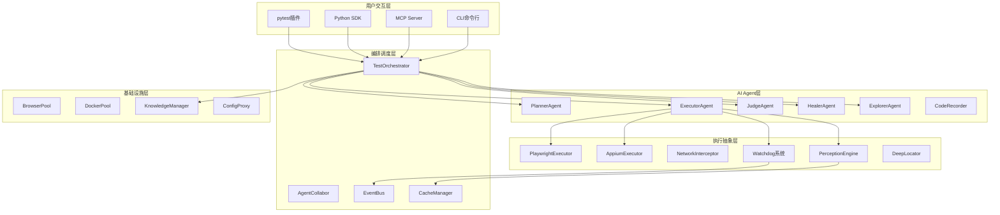
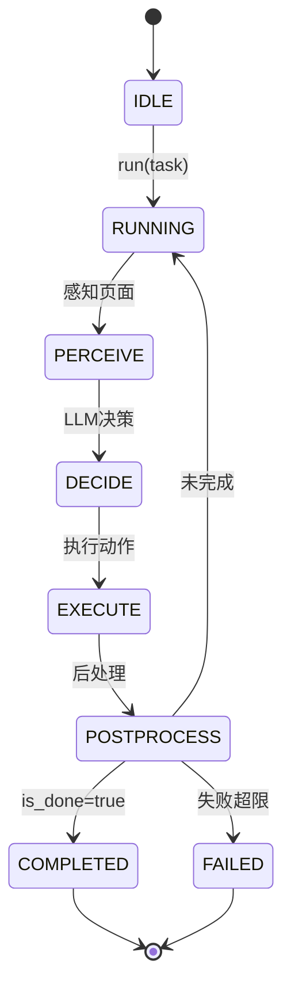
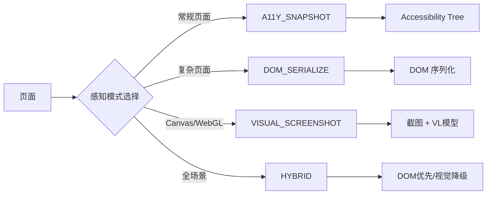
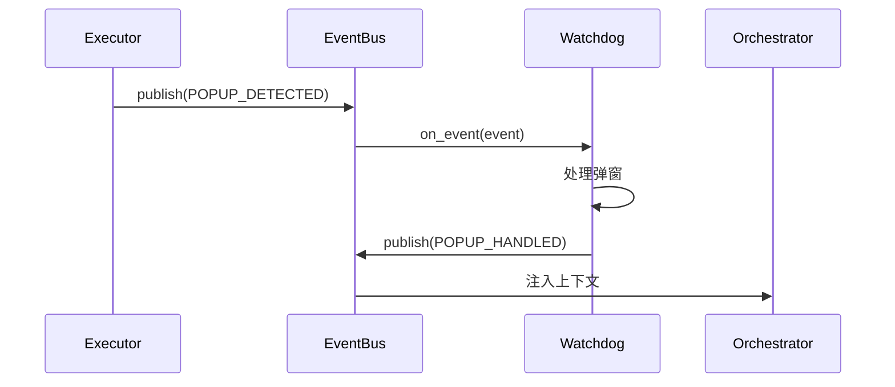
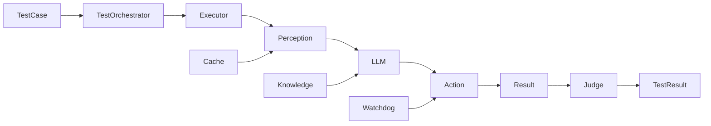
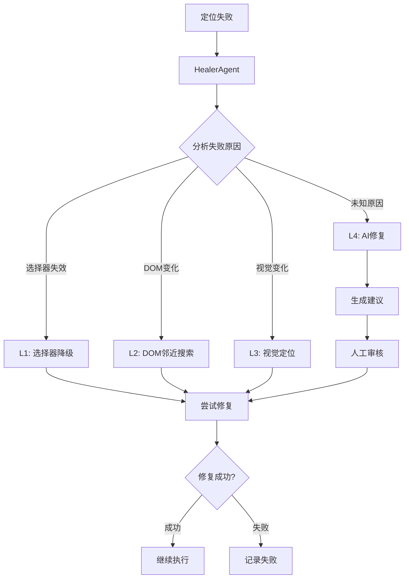
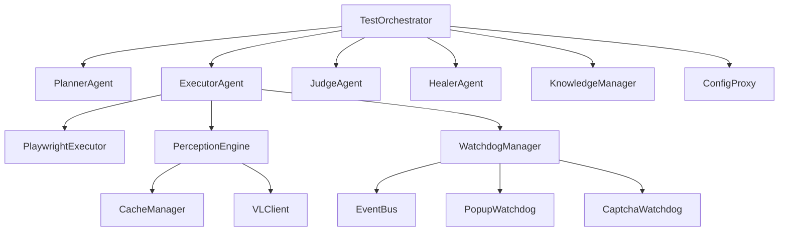

# 架构设计

本文档详细介绍 UIAI 的架构设计和模块划分。

---

## 目录

1. [整体架构](#一整体架构)
2. [六层架构详解](#二六层架构详解)
3. [Agent 循环机制](#三agent-循环机制)
4. [感知引擎架构](#四感知引擎架构)
5. [Watchdog 事件系统](#五watchdog-事件系统)
6. [数据流设计](#六数据流设计)
7. [模块依赖关系](#七模块依赖关系)
8. [扩展点设计](#八扩展点设计)

---

## 一、整体架构

### 1.1 架构概览



### 1.2 架构特点

| 特点 | 说明 |
|------|------|
| **分层架构** | 六层架构，职责清晰 |
| **模块化** | 模块独立，易于扩展 |
| **事件驱动** | EventBus 模块间通信 |
| **插件化** | 支持插件扩展 |
| **多平台支持** | Web/App/H5 统一抽象 |

---

## 二、六层架构详解

### 2.1 用户交互层

**职责**: 提供多种使用入口

| 模块 | 说明 |
|------|------|
| CLI | 命令行工具，快速使用 |
| MCP Server | MCP 协议，支持 Claude Code |
| Python SDK | Python API，灵活集成 |
| pytest 插件 | pytest 集成，CI/CD 支持 |

### 2.2 编排调度层

**职责**: 统一调度、事件通信

| 模块 | 说明 |
|------|------|
| TestOrchestrator | 测试编排中控 |
| AgentCollabor | Agent 协作管理 |
| EventBus | 事件总线 |
| CacheManager | 缓存管理 |

### 2.3 AI Agent 层

**职责**: AI 决策与执行

| 模块 | 说明 |
|------|------|
| PlannerAgent | 解析需求生成计划 |
| ExecutorAgent | 感知-决策-执行循环 |
| JudgeAgent | 评估执行结果 |
| HealerAgent | 失败时生成修复 |
| ExplorerAgent | 探索性测试 |
| CodeRecorder | 录制为可复现代码 |

### 2.4 执行抽象层

**职责**: 平台无关的执行抽象

| 模块 | 说明 |
|------|------|
| PlaywrightExecutor | Web 执行器 |
| AppiumExecutor | App 执行器 |
| NetworkInterceptor | 网络拦截 |
| Watchdog 系统 | 守卫系统 |
| PerceptionEngine | 感知引擎 |
| DeepLocator | 深度定位 |

### 2.5 基础设施层

**职责**: 资源管理与知识沉淀

| 模块 | 说明 |
|------|------|
| BrowserPool | 浏览器池 |
| DockerPool | Docker 池 |
| KnowledgeManager | 知识管理 |
| ConfigProxy | 配置代理 |

---

## 三、Agent 循环机制

### 3.1 ExecutorAgent 核心循环



### 3.2 循环详解

| 步骤 | 说明 |
|------|------|
| PERCEIVE | 感知页面状态，获取 A11y Tree/DOM/截图 |
| DECIDE | LLM 决策下一步动作 |
| EXECUTE | 执行动作（点击/输入/导航等） |
| POSTPROCESS | 后处理（检查结果、更新状态） |

### 3.3 循环控制

```python
# ExecutorAgent 循环伪代码
async def run_loop(self, task: str, max_steps: int = 50):
    step_count = 0
    is_done = False
    
    while step_count < max_steps and not is_done:
        # 1. 感知
        perception = await self.perceive()
        
        # 2. 决策
        action = await self.decide(perception)
        
        # 3. 执行
        result = await self.execute(action)
        
        # 4. 后处理
        is_done = await self.postprocess(result)
        
        step_count += 1
        
        # 循环检测
        if self._is_looping():
            break
    
    return self._build_result()
```

---

## 四、感知引擎架构

### 4.1 感知模式选择



### 4.2 感知流程

```python
# PerceptionEngine 感知伪代码
async def perceive(self, mode: PerceptionMode):
    if mode == PerceptionMode.A11Y_SNAPSHOT:
        # Accessibility Tree 快照
        tree = await self.executor.get_accessibility_tree()
        return self._format_a11y(tree)
    
    elif mode == PerceptionMode.DOM_SERIALIZE:
        # DOM 序列化
        dom = await self.executor.evaluate("serializeDOM()")
        return self._format_dom(dom)
    
    elif mode == PerceptionMode.VISUAL_SCREENSHOT:
        # 截图 + VL 模型
        screenshot = await self.executor.screenshot()
        description = await self.vl_client.describe(screenshot)
        return description
    
    elif mode == PerceptionMode.HYBRID:
        # DOM 优先，视觉降级
        try:
            dom = await self.executor.get_accessibility_tree()
            if self._is_sufficient(dom):
                return self._format_a11y(dom)
        except:
            pass
        
        screenshot = await self.executor.screenshot()
        description = await self.vl_client.describe(screenshot)
        return description
```

---

## 五、Watchdog 事件系统

### 5.1 事件流程



### 5.2 事件类型

| 事件类型 | 说明 | 数据 |
|---------|------|------|
| POPUP_DETECTED | 弹窗检测 | {type, message} |
| POPUP_HANDLED | 弹窗处理完成 | {action, result} |
| CAPTCHA_DETECTED | 验证码检测 | {type, location} |
| CRASH_DETECTED | 崩溃检测 | {reason} |
| CRASH_RECOVERED | 崩溃恢复 | {checkpoint} |
| NETWORK_ERROR | 网络错误 | {error, url} |
| DOM_CHANGED | DOM 变更 | {change_type} |
| STEP_COMPLETED | 步骤完成 | {step, result} |
| TEST_COMPLETED | 测试完成 | {test_id, status} |

### 5.3 Watchdog 注册

```python
# WatchdogManager 注册伪代码
class WatchdogManager:
    def __init__(self, event_bus: EventBus):
        self._bus = event_bus
        self._watchdogs = []
    
    def register(self, watchdog: BaseWatchdog):
        self._watchdogs.append(watchdog)
        watchdog.subscribe(self._bus)
    
    async def start_all(self):
        for watchdog in self._watchdogs:
            await watchdog.start()
    
    async def stop_all(self):
        for watchdog in self._watchdogs:
            await watchdog.stop()
```

---

## 六、数据流设计

### 6.1 测试执行数据流



### 6.2 自愈数据流



---

## 七、模块依赖关系

### 7.1 核心模块依赖



### 7.2 模块职责

| 模块 | 职责 | 依赖 |
|------|------|------|
| TestOrchestrator | 测试编排 | Agent, Executor, Knowledge |
| ExecutorAgent | 执行循环 | Executor, Perception, Watchdog |
| PerceptionEngine | 感知页面 | Executor, VLClient, Cache |
| WatchdogManager | 守卫管理 | EventBus, Watchdogs |
| CacheManager | 缓存管理 | 无外部依赖 |
| KnowledgeManager | 知识管理 | 无外部依赖 |

---

## 八、扩展点设计

### 8.1 Agent 扩展点

```python
# BaseAgent 抽象类
class BaseAgent:
    name: str
    role: AgentRole
    llm_client: LLMClient
    
    async def run(self, input_data, **kwargs) -> AgentOutput:
        raise NotImplementedError
    
    async def _build_prompt(self, input_data) -> str:
        raise NotImplementedError
    
    async def _parse_output(self, response) -> AgentOutput:
        raise NotImplementedError
```

### 8.2 Watchdog 扩展点

```python
# BaseWatchdog 抽象类
class BaseWatchdog:
    name: str
    _bus: EventBus
    
    async def start(self) -> None:
        raise NotImplementedError
    
    async def stop(self) -> None:
        raise NotImplementedError
    
    async def on_event(self, event: Event) -> dict | None:
        raise NotImplementedError
```

### 8.3 Executor 扩展点

```python
# BaseExecutor 抽象类
class BaseExecutor:
    platform: Platform
    
    async def start(self, **kwargs) -> None:
        raise NotImplementedError
    
    async def stop(self) -> None:
        raise NotImplementedError
    
    async def navigate(self, url: str) -> None:
        raise NotImplementedError
    
    async def click(self, locator: Locator) -> None:
        raise NotImplementedError
    
    # ... 其他方法
```

### 8.4 Plugin 扩展点

```python
# BasePlugin 抽象类
class BasePlugin:
    name: str
    version: str
    
    async def on_hook(self, hook: PluginHook, data: dict) -> dict:
        raise NotImplementedError
```

### 8.5 Skill 扩展点

```python
# Skill 抽象类
class Skill:
    name: str
    description: str
    input_primitives: list[InputPrimitive]
    
    async def execute(self, context, inputs) -> dict:
        raise NotImplementedError
```

---

## 九、设计原则

### 9.1 SOLID 原则应用

| 原则 | 应用 |
|------|------|
| **单一职责** | 每个 Agent 只负责一个职责 |
| **开放封闭** | 通过抽象类支持扩展 |
| **里氏替换** | Executor 可替换（Playwright/Appium） |
| **接口隔离** | EventBus 接口精简 |
| **依赖倒置** | 高层模块依赖抽象接口 |

### 9.2 设计模式应用

| 模式 | 应用场景 |
|------|---------|
| **工厂模式** | ExecutorFactory 创建执行器 |
| **策略模式** | 感知模式选择 |
| **观察者模式** | EventBus 事件订阅 |
| **责任链模式** | 自愈降级链 |
| **代理模式** | ConfigProxy 配置代理 |
| **单例模式** | EventBus 单例 |

---

> **下一步**: 查看 [开发者指南](./developer-guide.md) 了解如何扩展 UIAI。