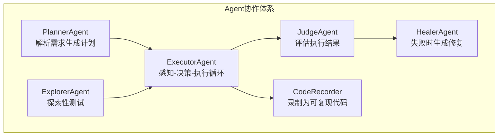
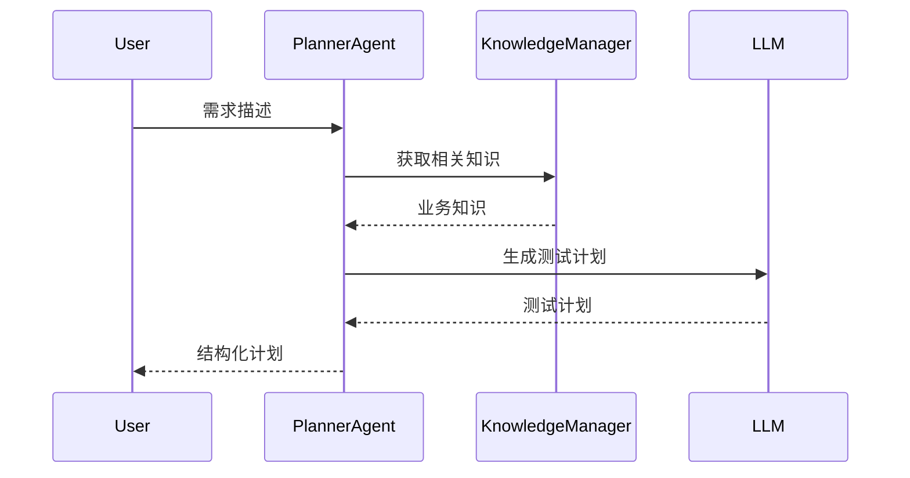
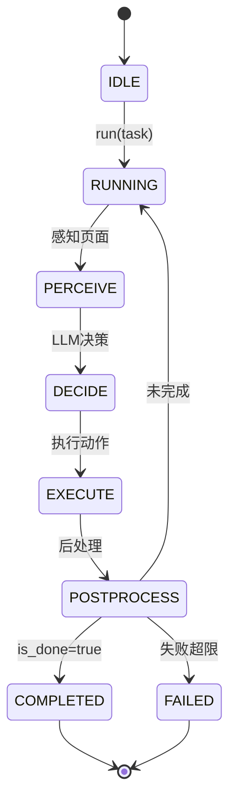
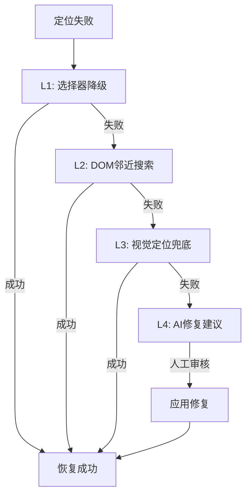
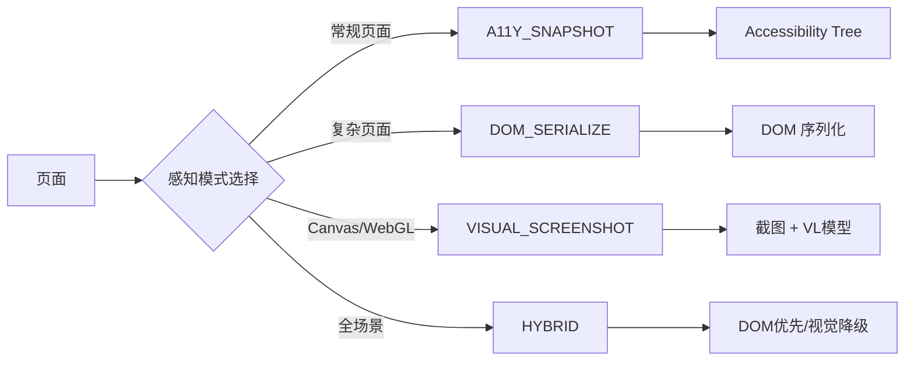
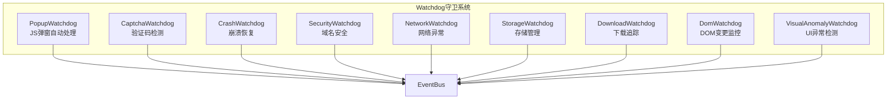
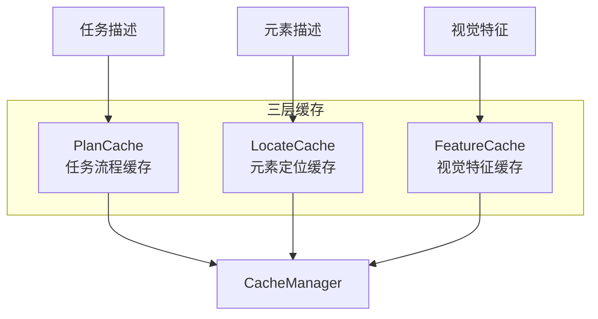

# 核心概念

本文档详细介绍 UIAI 的核心概念和设计理念。

---

## 目录

1. [六 Agent 协作体系](#一六-agent-协作体系)
2. [四层运行模式](#二四层运行模式)
3. [四种感知模式](#三四感知模式)
4. [九种 Watchdog 守卫](#四九种-watchdog-守卫)
5. [四层自愈降级](#五四层自愈降级)
6. [三层缓存系统](#六三层缓存系统)
7. [三级知识沉淀](#七三级知识沉淀)
8. [多模型意图路由](#八多模型意图路由)
9. [检查点机制](#九检查点机制)
10. [安全保障](#十安全保障)

---

## 一、六 Agent 协作体系

UIAI 的核心是六种 Agent 的协作，每种 Agent 负责不同的职责。

### 1.1 Agent 概览



### 1.2 PlannerAgent（规划 Agent）

**职责**: 解析自然语言需求，生成结构化测试计划

**输入**:
- 自然语言需求描述
- 业务知识上下文
- 历史测试经验

**输出**:
- 测试计划（Markdown 格式）
- 测试步骤列表
- 预期结果

**工作流程**:



**示例**:

```python
from uiai import TestOrchestrator

orchestrator = TestOrchestrator(config)

# 生成测试计划
plan = await orchestrator.generate_test_plan(
    requirement="测试购物车功能：添加商品、修改数量、删除商品、结算"
)

print(plan.output)
# 输出：
# # 购物车功能测试计划
# 
# ## 测试场景
# 1. 添加商品到购物车
# 2. 修改购物车商品数量
# 3. 删除购物车商品
# 4. 购物车结算
# 
# ## 测试步骤
# ### 场景1：添加商品到购物车
# 1. 打开商品详情页
# 2. 点击"加入购物车"按钮
# 3. 验证购物车数量增加
# ...
```

### 1.3 ExecutorAgent（执行 Agent）

**职责**: 感知页面状态，决策下一步动作，执行操作

**核心循环**: 感知 → 决策 → 执行 → 后处理



**感知模式**:

| 模式 | 说明 | Token 消耗 |
|------|------|-----------|
| A11Y_SNAPSHOT | Accessibility Tree 快照 | 低（~500 tokens） |
| DOM_SERIALIZE | DOM 序列化 | 中（~2000 tokens） |
| VISUAL_SCREENSHOT | 截图 + VL 模型 | 高（~1500 tokens + 图片） |
| HYBRID | DOM 优先，视觉降级 | 动态 |

**决策过程**:

```python
# ExecutorAgent 决策伪代码
async def decide(self, perception_result):
    # 1. 构建提示词
    prompt = self._build_prompt(perception_result)
    
    # 2. 调用 LLM
    response = await self.llm_client.chat(prompt)
    
    # 3. 解析动作
    action = self._parse_action(response)
    
    # 4. 验证动作
    if self._is_valid_action(action):
        return action
    else:
        return self._fallback_action()
```

### 1.4 JudgeAgent（评估 Agent）

**职责**: 独立评估执行结果是否成功

**输入**:
- 任务描述
- 执行历史
- 页面状态

**输出**:
- 评估结论（成功/失败）
- 失败原因
- 改进建议

**评估维度**:

| 维度 | 说明 |
|------|------|
| 目标达成 | 任务目标是否完成 |
| 数据正确 | 提取的数据是否正确 |
| 状态一致 | 页面状态是否符合预期 |
| 无副作用 | 是否产生意外副作用 |

**示例**:

```python
# JudgeAgent 评估
judgment = await judge_agent.run(
    task="登录系统并查看订单列表",
    execution_history=history,
    current_state=page_state
)

print(judgment.success)  # True/False
print(judgment.reason)   # "成功登录并跳转到订单列表页"
```

### 1.5 HealerAgent（修复 Agent）

**职责**: 分析失败原因，生成修复建议

**修复策略**:



**修复记录**:

```python
# 查看修复记录
healing_records = result.healing_records

for record in healing_records:
    print(f"步骤: {record.step_name}")
    print(f"原始定位: {record.original_locator}")
    print(f"修复策略: {record.strategy}")
    print(f"修复后定位: {record.healed_locator}")
    print(f"是否成功: {record.success}")
```

### 1.6 ExplorerAgent（探索 Agent）

**职责**: AI 探索性测试，发现潜在问题

**探索策略**:

| 策略 | 说明 |
|------|------|
| 链接遍历 | 自动遍历页面链接 |
| 表单填充 | 自动填充并提交表单 |
| 边界测试 | 自动测试边界值 |
| 异常输入 | 测试异常输入处理 |

**示例**:

```python
# AI 探索性测试
result = await orchestrator.explore(
    url="https://example.com",
    max_pages=20,
    max_depth=3
)

for issue in result.issues:
    print(f"问题: {issue.description}")
    print(f"严重程度: {issue.severity}")
    print(f"复现步骤: {issue.steps}")
```

### 1.7 CodeRecorder（代码录制 Agent）

**职责**: 录制执行过程为可复现代码

**输出格式**: Python 测试代码

**示例**:

```python
# 录制测试
result = await orchestrator.run_agent_test(
    "登录系统",
    record=True
)

# 获取录制的代码
code = result.recorded_code
print(code)

# 输出：
# from uiai import TestCase, Locator
# 
# test = TestCase(id="login", name="登录测试")
# test.add_step("导航", "navigate", value="https://example.com/login")
# test.add_step("输入用户名", "type", 
#     locator=Locator.by_test_id("username"), value="admin")
# test.add_step("输入密码", "type", 
#     locator=Locator.by_test_id("password"), value="123456")
# test.add_step("点击登录", "click", 
#     locator=Locator.by_role("button", name="登录"))
```

---

## 二、四层运行模式

UIAI 支持四层运行模式，从确定性脚本到完全自主 Agent。

### 2.1 模式概览

| 层级 | 模式 | 说明 | 适用场景 |
|------|------|------|---------|
| **R1_SCRIPT** | 确定性脚本 | 手写/录制的 Python 测试代码 | 稳定功能回归测试 |
| **R2_AGENT** | 智能 Agent 辅助 | Agent 感知 + LLM 决策 + 执行循环 | 新功能测试、复杂场景 |
| **R3_LOCAL_DEV** | 本地开发 | MCP Server + Claude Code CLI | 本地开发调试 |

### 2.2 R1_SCRIPT 模式

**特点**: 完全确定性，每个步骤明确指定

**适用场景**:
- 稳定功能的回归测试
- 需要精确控制的测试场景
- CI/CD 流水线集成

**示例**:

```python
from uiai import TestCase, Locator

test = TestCase(id="login", name="登录测试")

# 每个步骤明确指定
test.add_step("导航", "navigate", value="https://example.com/login")
test.add_step("输入用户名", "type", 
    locator=Locator.by_test_id("username"), value="admin")
test.add_step("输入密码", "type", 
    locator=Locator.by_test_id("password"), value="123456")
test.add_step("点击登录", "click", 
    locator=Locator.by_role("button", name="登录"))
test.add_step("验证跳转", "assert_url", value="https://example.com/home")
```

### 2.3 R2_AGENT 模式

**特点**: 自然语言驱动，Agent 自主决策

**适用场景**:
- 新功能测试
- 探索性测试
- 复杂业务流程

**示例**:

```python
# 自然语言驱动
result = await orchestrator.run_agent_test(
    "登录系统后查看订单列表，验证订单状态正确显示"
)

# 可以添加确定性预步骤
result = await orchestrator.run_agent_test(
    "搜索商品并添加到购物车",
    initial_actions=[
        {"action_type": "navigate", "params": {"url": "https://example.com"}},
        {"action_type": "click", "params": {"selector": "#accept-cookies"}}
    ]
)
```

### 2.4 R3_LOCAL_DEV 模式

**特点**: MCP Server + Claude Code CLI 本地开发

**适用场景**:
- 本地开发调试
- 快速原型验证

**启动 MCP Server**:

```bash
uiai mcp --host 0.0.0.0 --port 8080
```

---

## 三、四种感知模式

Agent 如何"看"页面，决定了 Token 消耗和感知精度。

### 3.1 感知模式概览



### 3.2 A11Y_SNAPSHOT 模式

**原理**: 提取 Accessibility Tree，获取页面语义结构

**优点**:
- Token 消耗低（~500 tokens）
- 语义清晰，易于理解
- 适合常规页面

**缺点**:
- 无法获取视觉信息
- Canvas/WebGL 元素不可见

**示例输出**:

```
[document]
  [navigation] "主导航"
    [link] "首页"
    [link] "产品"
    [link] "关于我们"
  [main]
    [heading] "欢迎"
    [textbox] "搜索" value=""
    [button] "搜索"
    [list]
      [listitem] "商品1 - ¥99"
      [listitem] "商品2 - ¥199"
```

### 3.3 DOM_SERIALIZE 模式

**原理**: 序列化 DOM 树，保留完整元素信息

**优点**:
- 信息完整
- 包含元素索引
- 适合复杂页面

**缺点**:
- Token 消耗较高（~2000 tokens）
- 可能包含冗余信息

**示例输出**:

```json
{
  "tag": "div",
  "id": "app",
  "children": [
    {
      "tag": "input",
      "type": "text",
      "placeholder": "搜索",
      "data-testid": "search-input",
      "index": 0
    },
    {
      "tag": "button",
      "text": "搜索",
      "data-testid": "search-btn",
      "index": 1
    }
  ]
}
```

### 3.4 VISUAL_SCREENSHOT 模式

**原理**: 截图 + 视觉语言模型

**优点**:
- 可处理 Canvas/WebGL
- 视觉信息完整
- 适合图形化界面

**缺点**:
- Token 消耗高（~1500 tokens + 图片）
- 需要 VL 模型支持

**使用场景**:
- Canvas 绘图应用
- WebGL 3D 应用
- 图表可视化

### 3.5 HYBRID 模式

**原理**: DOM 优先，视觉降级

**策略**:
1. 首先尝试 DOM_SERIALIZE
2. 如果 DOM 信息不足，降级到 VISUAL_SCREENSHOT
3. 自动选择最优模式

**推荐**: 默认使用 HYBRID 模式

---

## 四、九种 Watchdog 守卫

测试执行过程中自动监控和应对异常情况。

### 4.1 Watchdog 概览



### 4.2 PopupWatchdog（弹窗守卫）

**职责**: 监听 JS 弹窗，自动处理

**支持类型**:
- `alert()` - 自动点击确定
- `confirm()` - 自动点击确定/取消
- `prompt()` - 自动输入默认值

**配置**:

```yaml
watchdog:
  popup:
    enabled: true
    default_action: accept  # accept / dismiss
    prompt_default: ""      # prompt 默认值
```

### 4.3 CaptchaWatchdog（验证码守卫）

**职责**: 检测验证码元素，自动处理或通知人工

**支持类型**:
- TOTP/HOTP 验证码（自动处理）
- 图形验证码（通知人工）
- 滑块验证码（通知人工）

**配置**:

```yaml
watchdog:
  captcha:
    enabled: true
    totp_secret: "your-totp-secret"  # TOTP 密钥
    notify_on_unknown: true           # 未知验证码通知人工
```

### 4.4 CrashWatchdog（崩溃守卫）

**职责**: 检测浏览器崩溃，自动恢复

**恢复策略**:
1. 检测崩溃事件
2. 重启浏览器
3. 恢复到最近检查点
4. 继续执行

**配置**:

```yaml
watchdog:
  crash:
    enabled: true
    max_restarts: 3        # 最大重启次数
    checkpoint_interval: 5 # 检查点间隔（步数）
```

### 4.5 SecurityWatchdog（安全守卫）

**职责**: 监控域名导航，拦截非白名单域名

**配置**:

```yaml
browser:
  allowed_domains:
    - "*.example.com"
    - "api.example.com"
  prohibited_domains:
    - "*.ads.com"
    - "*.tracking.com"
```

### 4.6 NetworkWatchdog（网络守卫）

**职责**: 检测网络异常，触发重试或降级

**监控指标**:
- 请求超时
- 响应错误码
- 网络断开

**配置**:

```yaml
watchdog:
  network:
    enabled: true
    timeout: 30000        # 超时时间（毫秒）
    retry_count: 3        # 重试次数
    retry_delay: 1000     # 重试延迟（毫秒）
```

### 4.7 StorageWatchdog（存储守卫）

**职责**: 管理 Cookie/LocalStorage，支持状态恢复

**功能**:
- 自动保存存储状态
- 支持检查点恢复
- 跨测试状态共享

**配置**:

```yaml
watchdog:
  storage:
    enabled: true
    save_cookies: true
    save_local_storage: true
    checkpoint_dir: "./checkpoints"
```

### 4.8 DownloadWatchdog（下载守卫）

**职责**: 追踪文件下载，等待下载完成

**配置**:

```yaml
watchdog:
  download:
    enabled: true
    download_dir: "./downloads"
    timeout: 60000        # 下载超时（毫秒）
```

### 4.9 DomWatchdog（DOM 守卫）

**职责**: 监控 DOM 变更，触发缓存失效

**监控事件**:
- DOM 结构变化
- 元素属性变化
- 元素位置变化

**配置**:

```yaml
watchdog:
  dom:
    enabled: true
    debounce: 500         # 防抖时间（毫秒）
```

### 4.10 VisualAnomalyWatchdog（视觉异常守卫）

**职责**: 检测 UI 异常

**检测类型**:
- 白屏检测
- 空图检测
- 元素堆叠检测
- 布局错乱检测

**配置**:

```yaml
watchdog:
  visual_anomaly:
    enabled: true
    white_screen_threshold: 0.95  # 白屏阈值
    empty_image_threshold: 0.9    # 空图阈值
```

---

## 五、四层自愈降级

定位失败时自动尝试修复，提高测试稳定性。

### 5.1 自愈流程


### 5.2 L1: 选择器降级

**策略**: 尝试 Locator 的 fallback chain

**示例**:

```python
from uiai import Locator, LocatorType

# 定义多级降级策略
locator = Locator.by_test_id("username")
    .with_fallback(LocatorType.CSS, "#username")
    .with_fallback(LocatorType.XPATH, "//input[@name='username']")
    .with_fallback(LocatorType.TEXT, "用户名")
```

**降级顺序**: ROLE → TEST_ID → LABEL → PLACEHOLDER → TEXT → CSS → XPATH

### 5.3 L2: DOM 邻近搜索

**策略**: 在 A11y Tree 中搜索相似元素

**搜索维度**:
- 文本相似度
- 属性相似度
- 位置相似度
- 结构相似度

**示例**:

```python
# 原始定位失败
# 尝试在 DOM 中搜索相似元素
# 找到文本相似的按钮
```

### 5.4 L3: 视觉定位兜底

**策略**: 使用 VL 模型进行视觉定位

**适用场景**:
- DOM 结构变化
- 动态 ID/Class
- Canvas/WebGL 元素

**配置**:

```yaml
healing:
  strategies:
    - visual_ocr
  visual:
    model: "gpt-4-vision-preview"
    threshold: 0.8
```

### 5.5 L4: AI 修复建议

**策略**: LLM 分析失败原因，生成修复建议

**流程**:
1. 收集失败上下文
2. LLM 分析失败原因
3. 生成修复建议
4. 人工审核确认
5. 应用修复

**配置**:

```yaml
healing:
  enabled: true
  auto_apply: false  # 需人工审核
  max_retries: 3
```

---

## 六、三层缓存系统

减少 LLM 调用，提升执行效率。

### 6.1 缓存概览



### 6.2 PlanCache（任务流程缓存）

**键**: 任务描述哈希 + 页面结构哈希

**值**: 工作流步骤列表

**失效条件**: 页面结构哈希变化

**示例**:

```python
# 缓存命中
cached_plan = await cache_manager.get_plan("登录系统")
if cached_plan:
    # 使用缓存计划，减少 LLM 调用
    steps = cached_plan.steps
```

### 6.3 LocateCache（元素定位缓存）

**键**: 元素描述

**值**: 定位信息（selector/rect）

**失效条件**: 元素位置/形态变化

**示例**:

```python
# 缓存命中
cached_locate = await cache_manager.get_locate("用户名输入框")
if cached_locate:
    # 使用缓存定位，减少 LLM 调用
    selector = cached_locate.selector
```

### 6.4 FeatureCache（视觉特征缓存）

**键**: 元素描述

**值**: 视觉特征向量

**失效条件**: 视觉样式变化

**示例**:

```python
# 缓存命中
cached_feature = await cache_manager.get_feature("登录按钮")
if cached_feature:
    # 使用缓存特征，加速视觉定位
    features = cached_feature.features
```

### 6.5 缓存管理

```python
from uiai.core.cache import CacheManager

# 创建缓存管理器
cache_manager = CacheManager()

# 查看缓存统计
stats = await cache_manager.stats()
print(f"Plan 缓存: {stats['plan_count']} 条")
print(f"Locate 缓存: {stats['locate_count']} 条")
print(f"Feature 缓存: {stats['feature_count']} 条")

# 清除所有缓存
await cache_manager.clear_all()

# 持久化到磁盘
await cache_manager.save_to_disk()

# 从磁盘加载
await cache_manager.load_from_disk()
```

---

## 七、三级知识沉淀

自动积累测试经验，越用越智能。

### 7.1 知识级别

| 级别 | 来源 | 说明 | 示例 |
|------|------|------|------|
| **需求级** | 需求文档、用户故事 | 业务需求知识 | "购物车最多添加 99 件商品" |
| **产品级** | 产品文档、设计规范 | 产品功能说明 | "登录页面布局规范" |
| **经验级** | 测试执行中的积累 | 成功/失败案例 | "登录成功后跳转到首页" |

### 7.2 知识管理

```python
from uiai.core.knowledge import KnowledgeManager, KnowledgeLevel

km = KnowledgeManager()

# 添加需求级知识
await km.add_requirement(
    domain="ecommerce",
    title="购物车数量限制",
    content="购物车最多添加 99 件商品，超过限制时显示提示信息",
    tags=["购物车", "限制"]
)

# 添加产品级知识
await km.add_product(
    domain="ecommerce",
    title="登录页面布局",
    content="登录页面包含用户名输入框、密码输入框、登录按钮，布局为垂直居中"
)

# 添加经验级知识（自动沉淀）
await km.add_experience(
    domain="ecommerce",
    title="登录成功案例",
    content="用户名 admin，密码 123456，登录成功后跳转到首页",
    source="agent_learned",
    success=True
)
```

### 7.3 知识检索

```python
# 搜索知识
results = await km.search("购物车", domain="ecommerce", top_k=5)

for result in results:
    print(f"标题: {result.title}")
    print(f"内容: {result.content}")
    print(f"级别: {result.level}")
    print(f"权重: {result.weight}")
```

### 7.4 构建上下文

```python
# 为 Agent 构建知识上下文
context = await km.build_context(
    query="测试购物车功能",
    domain="ecommerce",
    max_tokens=2000
)

print(context)
# 输出：
# ## 业务知识
# - 购物车最多添加 99 件商品
# - 登录页面布局规范
# 
# ## 测试经验
# - 登录成功案例：用户名 admin，密码 123456
```

---

## 八、多模型意图路由

不同任务自动路由到最优模型，优化成本和效果。

### 8.1 意图类型

| 意图 | 说明 | 推荐模型 |
|------|------|---------|
| **LOCATE** | 元素定位 | VL 模型（UI-TARS-7B） |
| **PLAN** | 任务规划 | 强 LLM（GPT-4o） |
| **EXTRACT** | 信息提取 | 轻量模型（GPT-3.5） |
| **ASSERT** | 视觉断言 | VL 模型（GPT-4-Vision） |
| **HEAL** | 自愈修复 | 强 LLM（GPT-4o） |

### 8.2 路由配置

```yaml
llm:
  provider: openai
  model: gpt-4o              # 主模型（PLAN/HEAL）
  vl_model: gpt-4-vision-preview  # 视觉模型（LOCATE/ASSERT）
  extract_model: gpt-3.5-turbo    # 轻量模型（EXTRACT）
  locate_model: ui-tars-7b        # 定位模型（LOCATE）
```

### 8.3 路由逻辑

```python
# 意图路由伪代码
def route_to_model(intent: str):
    if intent == "LOCATE":
        return config.llm.locate_model or config.llm.vl_model
    elif intent == "PLAN":
        return config.llm.model
    elif intent == "EXTRACT":
        return config.llm.extract_model or config.llm.fallback_model
    elif intent == "ASSERT":
        return config.llm.vl_model
    elif intent == "HEAL":
        return config.llm.model
    else:
        return config.llm.model
```

---

## 九、检查点机制

支持测试执行中断后恢复。

### 9.1 检查点类型

| 类型 | 说明 | 存储内容 |
|------|------|---------|
| **存储检查点** | Cookie/LocalStorage 状态 | 存储数据 |
| **状态检查点** | 页面状态 | URL、表单数据 |
| **步骤检查点** | 执行步骤 | 已完成步骤列表 |

### 9.2 检查点配置

```yaml
checkpoint:
  enabled: true
  interval: 5            # 每 5 步创建检查点
  storage_dir: "./checkpoints"
  max_checkpoints: 10    # 最大检查点数量
```

### 9.3 恢复执行

```python
# 从检查点恢复
result = await orchestrator.run_test(
    test,
    resume_from="checkpoint_001"
)
```

---

## 十、安全保障

### 10.1 域名安全

**配置白名单**:

```yaml
browser:
  allowed_domains:
    - "*.example.com"
    - "api.example.com"
```

**配置黑名单**:

```yaml
browser:
  prohibited_domains:
    - "*.ads.com"
    - "*.tracking.com"
```

### 10.2 敏感数据保护

**环境变量**:

```bash
export OPENAI_API_KEY="sk-xxx"
export TEST_PASSWORD="xxx"
```

**配置文件加密**:

```yaml
secrets:
  api_key: "${OPENAI_API_KEY}"
  password: "${TEST_PASSWORD}"
```

### 10.3 执行限制

```yaml
security:
  max_steps: 100         # 最大执行步数
  max_time: 600          # 最大执行时间（秒）
  allowed_actions:       # 允许的动作
    - navigate
    - click
    - type
    - fill
  prohibited_actions:    # 禁止的动作
    - execute_script
```

---

> **下一步**: 了解 [配置详解](./configuration.md) 或查看 [API 参考](./api-reference.md)。